<p align="center">
    
</p>

<h1 align="center">RickAndMortyInfoverse</h1>

<p align="center">
    
    
</p>

**RickAndMortyInfoverse** is an iOS app built using SwiftUI that connects to the [Rick and Morty API](https://rickandmortyapi.com/), allowing users to explore characters, episodes, and locations from the show. The app uses a clean MVVM architecture, includes advanced scroll view behaviors, and features a custom tab bar with animations based on user interaction.

## Features

- **SwiftUI & URLSession**: Utilized for making asynchronous API calls to the Rick and Morty API.
- **Async/Await**: Modern concurrency with async/await for handling REST API requests.
- Model Binding: Results are decoded into models and bound to views for seamless UI updates.
- **LazyVGrid** for Characters & Episodes: Displays a grid of characters and episode details using a performant grid layout.
- **ListView** for Locations: The app includes a list view for browsing the different locations from the show.
- **Scroll View Behavior**: Using **GeometryReader**, the app detects scrolling direction and shows/hides the tab bar accordingly.
- Custom Tab Bar: A visually appealing, custom-designed tab bar that responds to scrolling behavior.
- **MVVM Architecture**: Implements **Model-View-ViewModel architecture** for better separation of concerns.
- Image Loading with **Kingfisher**: Third-party package Kingfisher is used for efficiently loading and caching images of the characters.
- Search & Filter: Provides search functionality with filtering options via PickerWheel.
- Light Mode Only: The app currently supports only light mode.

## Screenshots

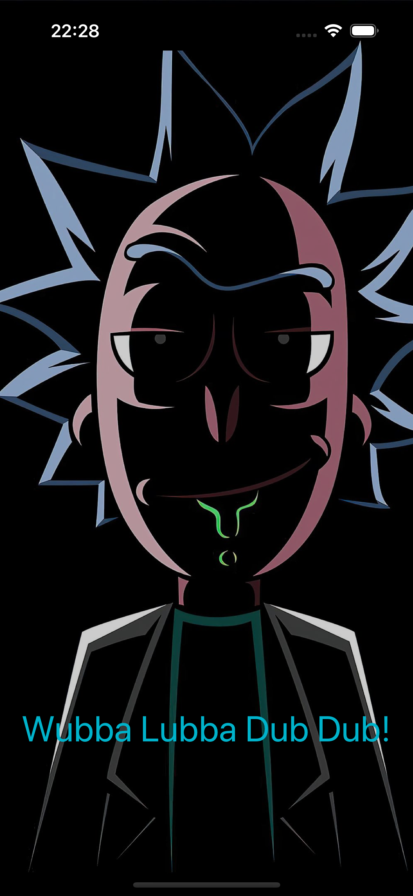

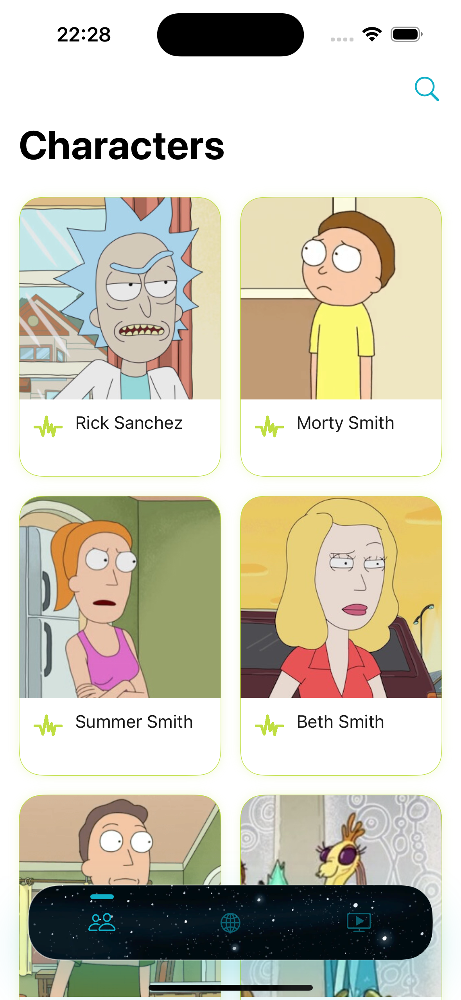
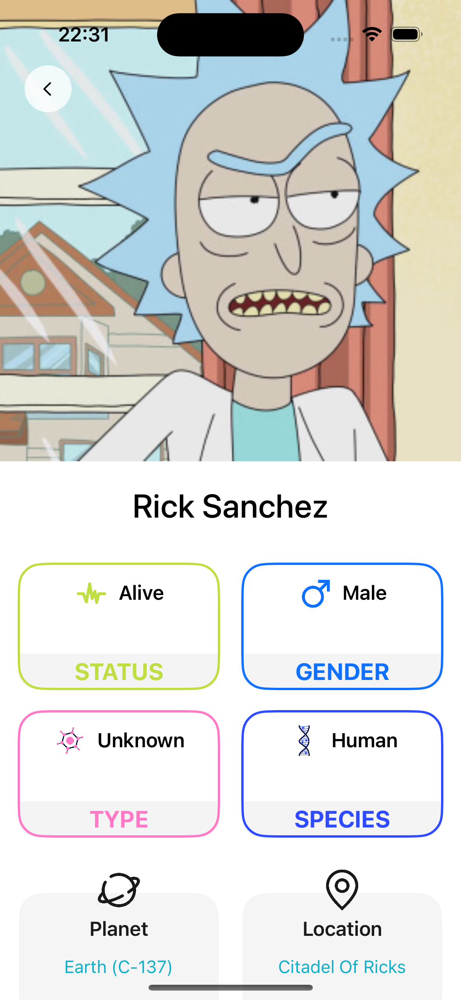
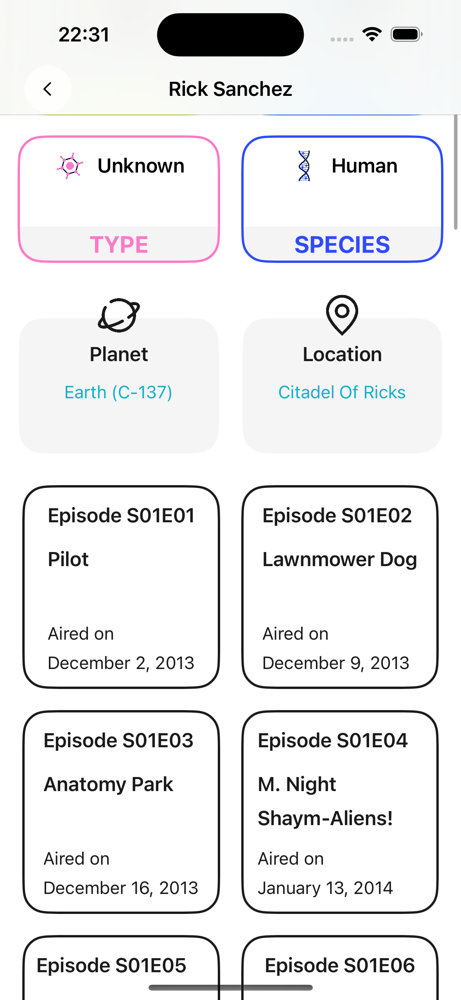
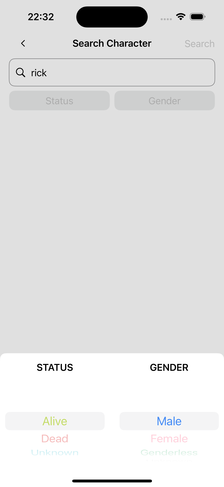
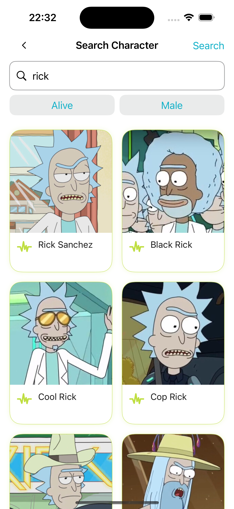

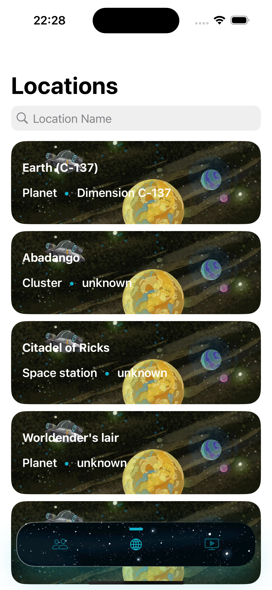
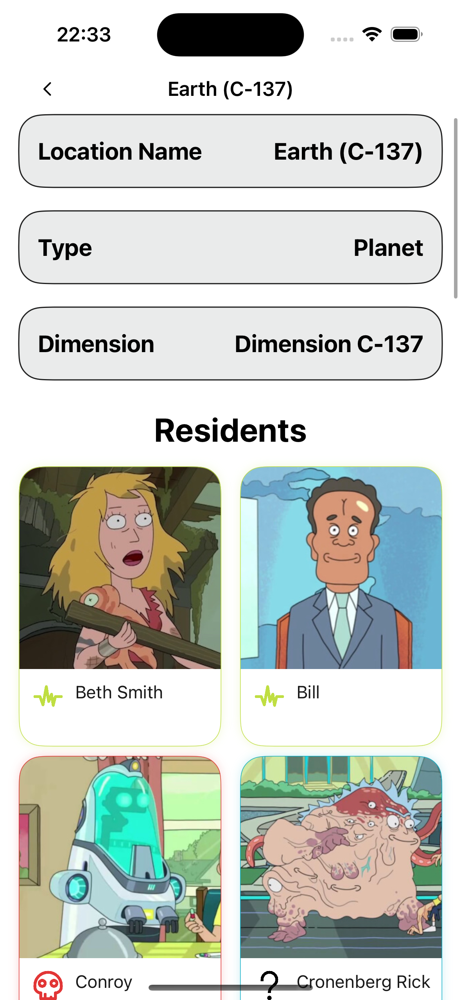
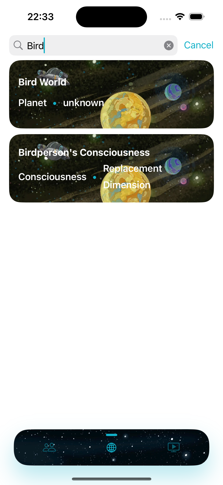

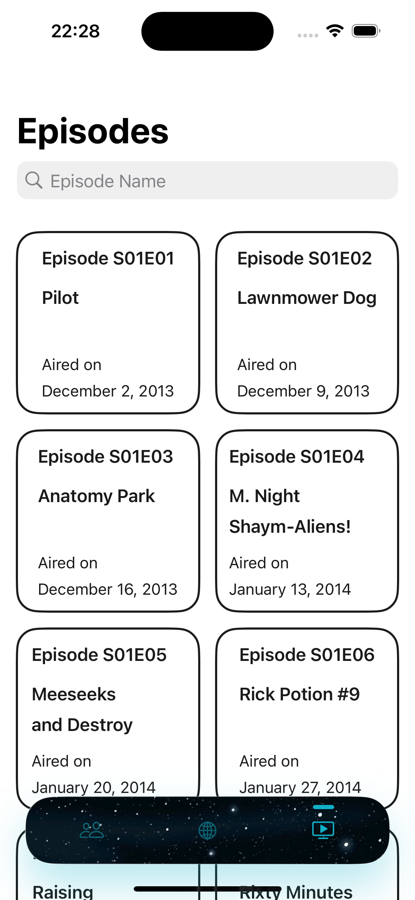
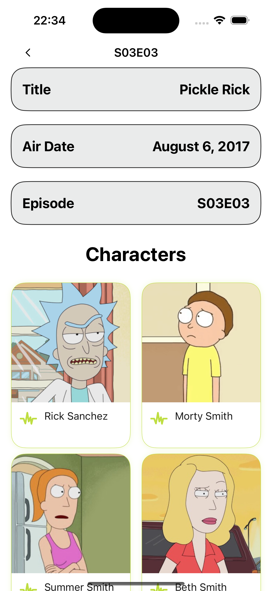
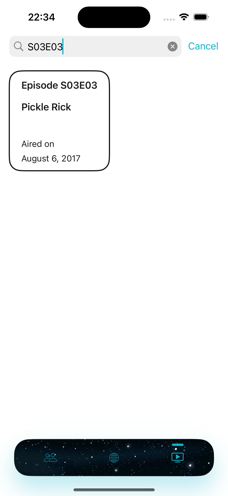

# Installation

1. Clone the repository:
   ```bash
   git clone https://github.com/yourusername/RickAndMortyInfoverse.git

2. Open the project in Xcode.
    
3. Install dependencies (Kingfisher is included via Swift Package Manager):
   ```bash
   File > Swift Packages > Resolve Package Versions

4. Build and run the project on your simulator or device.

## Third-Party Libraries

- [Kingfisher](https://github.com/onevcat/Kingfisher) - Used for efficient image downloading and caching.

## API Reference

This app uses the open-source [Rick and Morty API](https://rickandmortyapi.com/documentation) for fetching information on:

- Characters
- Episodes
- Locations

## Future Improvements

- **Dark Mode Support**: Adding dark mode compatibility.
- **Favorites Feature**: Enable users to favorite characters, episodes, or locations.
- **Enhanced Filtering**: Allow more complex filtering options for characters and episodes.
  
## Contributing

Feel free to fork the repository and submit a pull request for any improvements or features you'd like to add.

## License

This project is licensed under the MIT License - see the [LICENSE](LICENSE) file for details.
